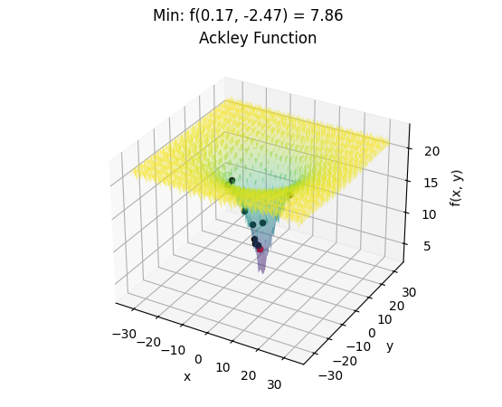
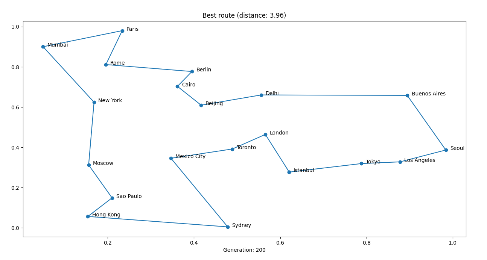

# Biologically inspired algorithms

This repository contains the code for the biologically inspired algorithms course. 
It includes implementations of algorithms inspired by natural processes to solve optimization and search problems.

## Setup

1. Clone the repository
    ```bash
    git clone https://github.com/Michailidu/BiologicallyInspiredAlgorithms.git
    ```
   
2. Create and activate a virtual environment
    ```bash
    python3 -m venv venv
    source venv/bin/activate
    ```

3. Install the requirements
    ```bash
    pip install -r requirements.txt
    ```
   
## Run
The repository contains two categories of algorithms:
1. 3D Function Optimization Algorithms
   These algorithms aim to optimize a mathematical function in 3D space.
2. Shortest Path Search Algorithms
   These algorithms focus on finding the shortest path in a graph.


### 3D Function Optimization Algorithms


To run the 3D function optimization algorithms, execute the following command:
```bash
python function_optimization/main.py --algorithm <algorithm> --function <function>
```

For the `--algorithm` option, you can choose between the following algorithms:
* `BlindSearch` - A brute-force search algorithm.
* `HillClimbing` - A local search algorithm, iteratively moves to the neighboring solution with the highest value.
* `SimulatedAnnealing` - A probabilistic local search algorithm, inspired by the annealing process in metallurgy. Uses both exploration and exploitation.
* `DifferentialEvolution` - A population-based optimization algorithm that evolves candidate solutions using crossover, mutation, and selection.
* `ParticleSwarm` - A population-based optimization algorithm that simulates the social behavior of birds in a flock.
* `SOMA` - A population-based optimization algorithm that uses a self-organizing migration algorithm.
* `Firefly` - Based on the flashing behavior of fireflies, this algorithm optimizes solutions by attracting particles to brighter or better-performing solutions.

For the `--function` options, you can choose between the following functions:
* `Ackley`
* `Sphere`
* `Schwefel`
* `Rosenbrock`
* `Rastrigin`
* `Griewank`
* `Levy`
* `Michalewicz`
* `Zakharov`

Run the following command to see more details:
```bash
python function_optimization/main.py --help
```

### Shortest Path Search Algorithms


To see the shortest path search parameters, execute the following command:
```bash
python shortest_path/main.py --help 
```

The parameters are:
* `--algorithm` - The algorithm to use, possible values are:
  * `Genetic` - A genetic algorithm that evolves a population of candidate solutions.
  * `AntColony` - An ant colony optimization algorithm that simulates the foraging behavior of ants.
* `--number_of_cities` - The number of cities to visit (default: 35).
* `--number_of_generations` - The number of generations (default: 200).
* `--number_of_individuals` - The number of individuals in the population (default: 40).
* `--plot` - Whether to plot the algorithm progress (default: True).